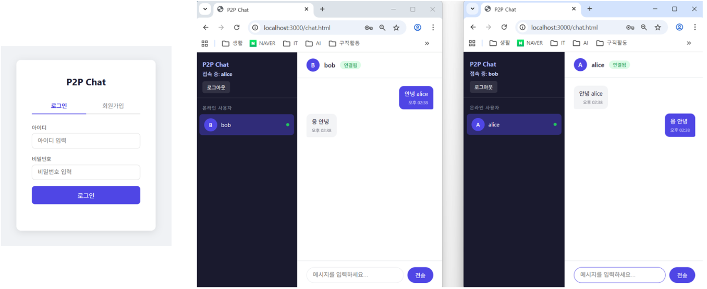

# P2P 1대1채팅 
* Claude Code를 이용해 만든 toy프로젝트
* 3개의 prompt로 완성한 아주 작은 프로젝트
## 세션 대화내용(토글 안에 claude의 답변)

  
로그인 기능과 p2p프로토콜을 이용한 1:1채팅기능이 있는 간단한 웹 프로젝트를 만들고싶어, 주요 기능들을 리스트해줘

  

    <ul>
      <li>주요 기능들 리스트
      </li>
      <li>기술스택 제안
      </li>
      <li>어떤 기술 스택으로 진행할지 알려주시면 상세 계획을 작성해드리겠습니다.
      </li>
    </ul>
  

  
옵션A(기술스택)으로 상세계획 작성해줘

  

    <ul>
      <li>클로드의 계획
      </li>
      <li>클로드는 계획을 실행할 준비가 됐습니다. 진행하시겠습니까?
      </li>
    </ul>
  

  
계획대로 진행해줘

  

    <ul>
      <li>프로젝트 생성됨. 구현이 완료되었습니다.
      </li>
      <li>완성 요약
      </li>
    </ul>
  

## vibe코딩 성공위해 필요한 것들
이번 프로젝트 성공후, 분석및 정리한거

  
주요 기능들 리스트

  

    <ul>
      <li>각 기능별 적당한 디테일
      </li>
      <li>자료구조 tree 형태로 디테일 조절, depth 를 몇까지할지 생각해야할듯 
      </li> 
      <li>여기선 depth 1까지만 했음 
      </li>
    </ul>
  

  
기술 스택

  

    <ul>
      <li>일반적인   
      프론트, 백엔드, db, 인증
      </li>
      <li>프로젝트별 특수한 필요 스택들 
      여기선 p2p, websocket
      </li>
    </ul>
  

  
(어떻게 구현할지) 상세 계획

  

    <ul>
      <li>Context
      </li>
      <li>프로젝트 구조
      </li>
      <li>백엔드 상세 계획
      </li>
      <li>프론트엔드 상세 계획
      </li>
      <li>구현 순서
      </li>
      <li>검증 방법
      </li>
    </ul>
  

## 소프트웨어 정보
* 주요기능 : 회원/인증 , p2p 1:1 채팅
* 기술스택 : Vanilla JS + Express.js + WebRTC DataChannel + SQLite

 
